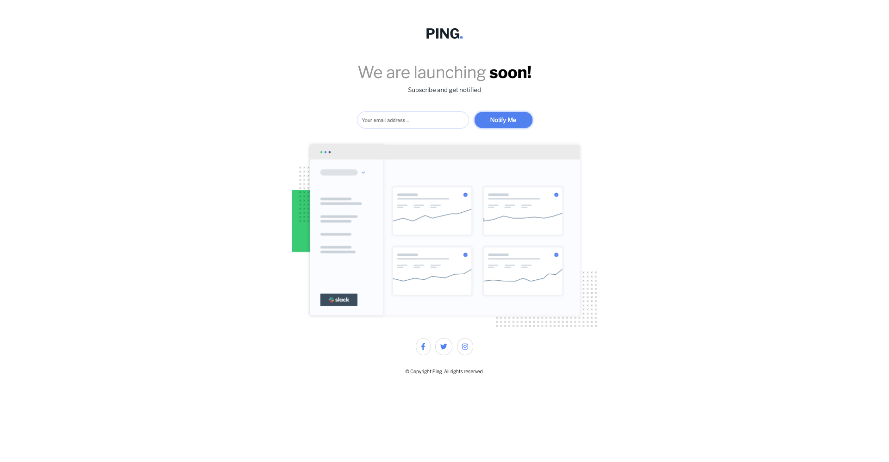
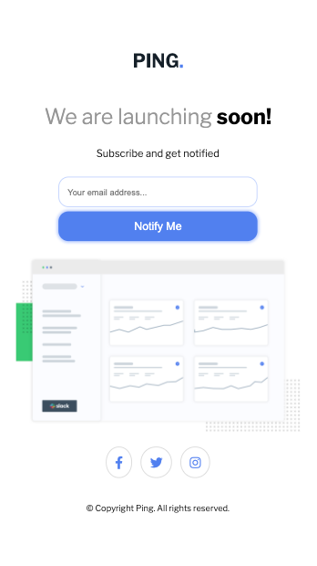
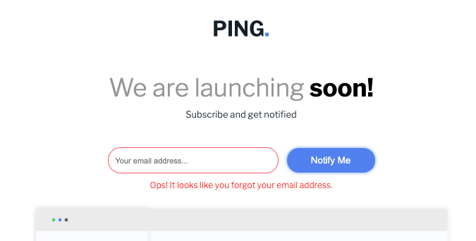
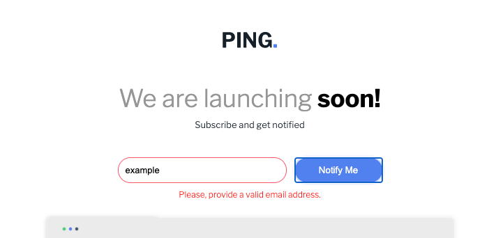

# Ping

- This project was a challenge created by Front End Mentor/Esse projeto foi um desafio criado por Front End Mentor = https://www.frontendmentor.io/dashboard

- This website was created to enhance my HTML/CSS/Javascript skills.
- Esse website foi criado com o intuito de melhorar minhas habilidades em HTML/CSS/Javascript.

# Design
## Desktop

 
 
## Mobile

## Features

- What users are able to do?

 	View the optimal layout for the site depending on their device's screen size.
	Visualizar o layout otimizado com base no dispositivo do usuário.	

 	See hover states for all interactive elements on the page
	Observar os efeitos hovers com os itens interativos da página.
	
	Submit their email address using an `input` field
	Enviar seu endereço de email utilizando o campo 'input'

 	Receive an error message when the `form` is submitted if:
	Receber uma mensagem de erro quando o 'form' for enviado se:

	- The `input` field is empty. The message for this error should say *"Ops! It looks like you forgot to add your email"*
	- O campo 'input' estiver vazio. A seguinte mensagem aparecerá: *"Ops! It looks like you forgot to add your email address.

	- The email address is not formatted correctly (i.e. a correct email address should have this structure: `name@host.tld`). The message for this error should say *"Please provide a valid email address"*
	- O endereço de email não foi corretamente formatado (um exemplo correto seria: `name@host.tld`). Nesse caso, a seguinte mensagem aparecerá *"Please provide a valid email address"*

### Active Elements

